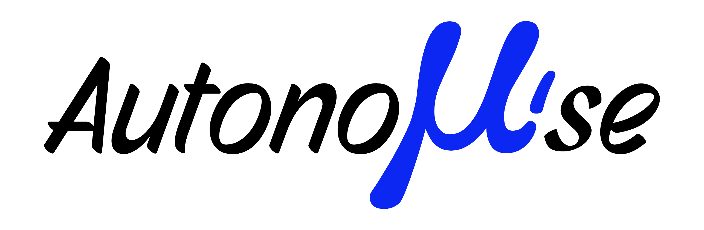

<p align="center">
  
</p>

<h1 align="center">Autonoμ'se</h1>

<p align="center">
  <strong>Audio. Video. Autonomy.</strong><br>
  A local-first media preservation and metadata enrichment desktop application.
</p>

---

## Overview

**Autonoμ'se** (pronounced *"Autonomuse"*) is a local-first media preservation and enrichment tool developed by **VANTASEED**. It grants users complete autonomy over organizing, enriching, and preserving personal audio and video collections without relying on restrictive cloud ecosystems.

Autonoμ'se combines background ingestion pipelines, acoustic fingerprinting, intelligent metadata tagging, and local cataloging tools inside a highly customizable desktop interface built with .NET 10 MAUI Blazor Hybrid.

---

## Key Features

- **Unified Audio & Video Library** — Catalog local music collections, audio playlists, and video directories in a single workspace.
- **Metadata Enrichment & Portability** — Enrich audio tracks with cover art and release details from global databases (MusicBrainz, Cover Art Archive, AcoustID), writing tags directly back to files so they remain portable across any player.
- **Automated Ingestion Pipeline** — Download and archive online audio and video content locally via integrated `yt-dlp` background workers.
- **Playlist Archiving & Sync** — Safeguard external online playlists locally with automated synchronization.
- **Deep Personalization** — Tailor the interface with dynamic theme accent colors, panel glassmorphism/blur sliders, text visual effects, and custom section background wallpapers.

---

## Technical Architecture

| Component | Technology |
| :--- | :--- |
| **Framework** | .NET 10 MAUI (Blazor Hybrid) |
| **UI Layer** | Razor Components + Vanilla CSS |
| **Database** | SQLite (`Microsoft.Data.Sqlite`) |
| **Media Ingestion** | `yt-dlp` |
| **Audio Fingerprinting** | AcoustID Chromaprint (`fpcalc`) |
| **Metadata Sources** | MusicBrainz API & Cover Art Archive |
| **Tagging Engine** | `TagLibSharp` |
| **Graphics Processing** | `SkiaSharp` |
| **Tool Operations** | Windows Package Manager (`winget`) |

---

## Getting Started

You can either install the pre-built application or build it from source.

### Option 1: Download Pre-built Installer
Download the latest installer (`Autonomuse_Setup.exe`) directly from the [Releases](https://github.com/VANTASEED/autonomuse/releases) page.

### Prerequisites
- **OS:** Windows 10 (Version 1809 / Build 17763 or higher) or Windows 11
- **Framework:** .NET 10.0 SDK
- **Dependencies:** `yt-dlp`, `fpcalc`, and `ffmpeg` (can be auto-installed and updated via `winget` within Settings)

### Option 2: Build from Source

1. Clone the repository:
   ```bash
   git clone https://github.com/VANTASEED/autonomuse.git
   cd autonomuse
   ```

2. Build and run via .NET CLI:
   ```bash
   dotnet build Autonomuse.csproj
   dotnet run --project Autonomuse.csproj
   ```

---

## Acknowledgements

Autonoμ'se stands on the shoulders of these open-source projects and services:

- [yt-dlp](https://github.com/yt-dlp/yt-dlp) — Media ingestion engine
- [MusicBrainz](https://musicbrainz.org/) — Open music encyclopedia
- [Cover Art Archive](https://coverartarchive.org/) — Community cover art repository
- [AcoustID](https://acoustid.org/) — Acoustic fingerprinting database
- [TagLibSharp](https://github.com/mono/taglib-sharp) — Media metadata library
- [SkiaSharp](https://github.com/mono/SkiaSharp) — Cross-platform 2D graphics engine

---

## License & Attribution

Developed with care by **VANTASEED Studio**.<br>
Powered by copious amounts of instant noodles, questionable caffeine tolerance, and a stubborn refusal to go touch grass.